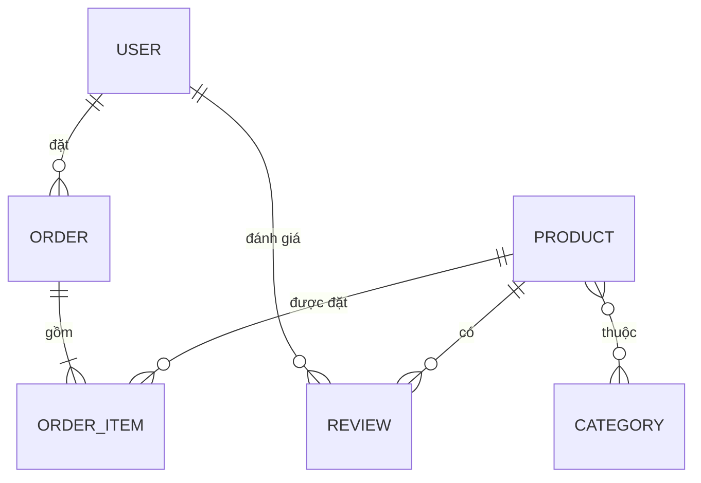
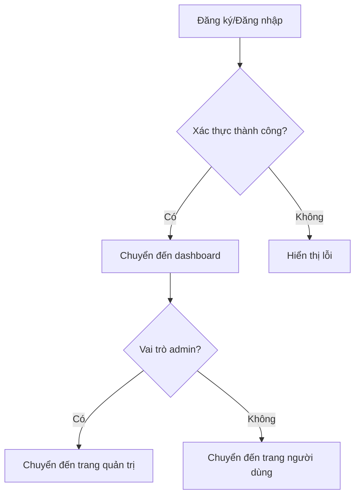

# Laravel Online Store

## 🛒 Giới thiệu

**Laravel Online Store** là một hệ thống thương mại điện tử hoàn chỉnh, xây dựng bằng Laravel, hỗ trợ quản lý sản phẩm, danh mục, giỏ hàng, đặt hàng, đánh giá, phân quyền người dùng, giao diện hiện đại và dễ mở rộng cho nhiều mục đích kinh doanh.

---

## 🛠️ Công nghệ sử dụng

- **Laravel 12**: Framework PHP mạnh mẽ cho phát triển web.
- **Laravel Breeze**: Định danh & xác thực người dùng (đăng ký, đăng nhập, xác thực email, quên mật khẩu).
- **CRUD đầy đủ cho Product**: Quản lý sản phẩm (tạo, xem, sửa, xóa) với validation, upload ảnh, phân quyền.
- **TailwindCSS**: Thiết kế giao diện hiện đại, responsive.
- **MySQL**: Lưu trữ dữ liệu.
- **Seeder & Migration**: Tạo dữ liệu mẫu và quản lý cấu trúc database.
- **Các biện pháp bảo mật**: CSRF, XSS, xác thực, phân quyền, session, cookies, validation, chống SQL Injection, policy, middleware.
- **RESTful API**: Hỗ trợ thao tác CRUD qua API cho Product.
- **Session & Cookies**: Quản lý đăng nhập, bảo vệ thông tin người dùng.
- **Eloquent ORM**: Truy vấn dữ liệu an toàn, tránh SQL Injection.
- **Aiven Cloud Database**: Sử dụng Eloquent để migrate và đồng bộ dữ liệu các Object trực tiếp lên database cloud (sử dụng Aiven).

---

## 🌟 Danh sách tính năng chi tiết

### 1. Quản lý sản phẩm
- Thêm, sửa, xóa sản phẩm với các trường: tên, mô tả, giá, tồn kho, hình ảnh, đánh giá, danh mục.
- Hỗ trợ upload ảnh sản phẩm, lưu trữ ảnh trong thư mục `public/images/products`.
- Hiển thị danh sách sản phẩm với phân trang, tìm kiếm, lọc theo danh mục.
- Xem chi tiết sản phẩm, hiển thị thông tin, đánh giá, tồn kho.

### 2. Quản lý danh mục
- Thêm, sửa, xóa danh mục sản phẩm.
- Gán sản phẩm vào danh mục, lọc sản phẩm theo danh mục.
- Hỗ trợ slug cho SEO.

### 3. Giỏ hàng & đặt hàng
- Thêm sản phẩm vào giỏ hàng, cập nhật số lượng, xóa khỏi giỏ.
- Đặt hàng, lưu thông tin đơn hàng và chi tiết từng sản phẩm.
- Quản lý đơn hàng cho cả user và admin.

### 4. Đánh giá sản phẩm
- Người dùng có thể đánh giá, nhận xét sản phẩm đã mua.
- Hiển thị điểm đánh giá trung bình trên từng sản phẩm.

### 5. Quản trị viên (Admin)
- Đăng nhập với quyền admin để quản lý toàn bộ sản phẩm, danh mục, đơn hàng, người dùng.
- Giao diện quản trị riêng biệt, bảo vệ bằng middleware.

### 6. Người dùng
- Đăng ký, đăng nhập, cập nhật thông tin cá nhân.
- Xem lịch sử đơn hàng, trạng thái đơn hàng.
- Đổi mật khẩu, quên mật khẩu qua email.

### 7. Giao diện & trải nghiệm
- Responsive, tối ưu cho mọi thiết bị với TailwindCSS.
- Navbar, phân trang, thông báo, xác nhận thao tác.
- Trang đăng nhập, đăng ký, quản lý tài khoản, giỏ hàng, checkout, dashboard admin.

### 8. Seed dữ liệu mẫu
- Tích hợp sẵn các seeder cho sản phẩm, danh mục, người dùng để thử nghiệm nhanh.

### 9. Bảo mật & hiệu năng
- Xác thực CSRF, phân quyền route, validate dữ liệu đầu vào.
- Sử dụng cache cho danh mục và sản phẩm để tăng tốc độ tải trang.

---

## 🗺️ Sơ đồ đối tượng & chức năng chính

---

### Sơ đồ quan hệ đối tượng



#### Mô tả chi tiết các đối tượng

| Đối tượng   | Thuộc tính chính                                                                 | Mối quan hệ                                                                 |
|-------------|----------------------------------------------------------------------------------|-----------------------------------------------------------------------------|
| **User**    | id, name, email, password, role, address, phone                                  | Có nhiều Order, nhiều Review                                                |
| **Product** | id, name, description, price, stock, image, category_id, rating                  | Thuộc về Category, có nhiều OrderItem, nhiều Review                         |
| **Category**| id, name, slug                                                                   | Có nhiều Product                                                            |
| **Order**   | id, user_id, total_price, status, created_at                                     | Thuộc về User, có nhiều OrderItem                                           |
| **OrderItem**| id, order_id, product_id, quantity, price                                       | Thuộc về Order, tham chiếu Product                                          |
| **Review**  | id, user_id, product_id, rating, comment, created_at                             | Thuộc về User và Product                                                    |

**Ví dụ dữ liệu mẫu:**

- User: Nguyễn Văn A, email: a@gmail.com, role: user
- Product: iPhone 15 Pro, price: 30,000,000 VNĐ, stock: 10, category: Điện thoại
- Category: Điện thoại, slug: dien-thoai
- Order: user_id: 1, total_price: 60,000,000 VNĐ, status: completed
- OrderItem: order_id: 1, product_id: 2, quantity: 2, price: 60,000,000 VNĐ
- Review: user_id: 1, product_id: 2, rating: 5, comment: "Sản phẩm tốt!"

**Tình huống sử dụng thực tế:**
- Người dùng đăng ký, đăng nhập, duyệt sản phẩm, thêm vào giỏ, đặt hàng, đánh giá sản phẩm.
- Admin quản lý sản phẩm, danh mục, đơn hàng, người dùng, kiểm duyệt đánh giá.

---

## 🔐 Định danh & xác thực

### Quy trình xác thực & phân quyền

- Sử dụng Laravel Breeze để triển khai đăng ký, đăng nhập, xác thực email, đổi mật khẩu, quên mật khẩu.
- Đăng ký: Người dùng nhập thông tin, xác thực email qua link gửi về hộp thư.
- Đăng nhập: Kiểm tra email, mật khẩu, lưu session và cookies.
- Phân quyền: Sử dụng middleware (`auth`, `admin`) để bảo vệ route quản trị.
- Đăng xuất: Xóa session, cookies.
- Quên mật khẩu: Gửi email reset, xác thực token.
- Đổi mật khẩu: Yêu cầu nhập mật khẩu cũ, xác thực trước khi đổi.

**Sơ đồ luồng xác thực:**


**Ví dụ route xác thực:**
```php
// routes/auth.php
Route::get('/login', [AuthenticatedSessionController::class, 'create'])->name('login');
Route::post('/login', [AuthenticatedSessionController::class, 'store']);
Route::post('/logout', [AuthenticatedSessionController::class, 'destroy'])->name('logout');
```

**Phân quyền trong controller:**
```php
public function __construct()
{
    $this->middleware('auth');
    $this->middleware('admin')->only(['destroy', 'edit', 'update']);
}
```

**Kiểm tra quyền trong Blade:**
```blade
@can('update', $product)
    <a href="{{ route('products.edit', $product) }}">Sửa</a>
@endcan
```

---

## 📝 Chức năng CRUD

### CRUD cho Product (Sản phẩm)

- **Create:** Admin thêm sản phẩm mới qua form hoặc API `/admin/products/create`.
- **Read:** Hiển thị danh sách sản phẩm, tìm kiếm, lọc, xem chi tiết.
- **Update:** Admin chỉnh sửa thông tin sản phẩm.
- **Delete:** Admin xóa sản phẩm khỏi hệ thống.

**Ví dụ route CRUD:**
```php
Route::resource('products', ProductController::class);
```

**Ví dụ giao diện:**
- Trang admin: Thêm/sửa/xóa sản phẩm, upload ảnh, nhập thông tin chi tiết.
- Trang người dùng: Xem danh sách, tìm kiếm, lọc theo danh mục, xem chi tiết sản phẩm.

**API mẫu (JSON):**
- `GET /api/products` – Lấy danh sách sản phẩm
- `POST /api/products` – Thêm sản phẩm (yêu cầu quyền admin)
- `PUT /api/products/{id}` – Sửa sản phẩm
- `DELETE /api/products/{id}` – Xóa sản phẩm

**Ví dụ FormRequest validate khi thêm sản phẩm:**
```php
public function rules()
{
    return [
        'name' => 'required|string|max:255',
        'price' => 'required|numeric|min:0',
        'image' => 'nullable|image|max:2048',
        'category_id' => 'required|exists:categories,id',
        // ...
    ];
}
```

### CRUD cho Category (Danh mục)

- Tương tự Product, hỗ trợ thêm/sửa/xóa/lấy danh mục.
- Cho phép admin quản lý danh mục, người dùng lọc sản phẩm theo danh mục.

### CRUD cho Order & Review

- Người dùng tạo đơn hàng khi checkout, xem lịch sử đơn hàng.
- Người dùng đánh giá sản phẩm đã mua, admin có thể xóa review vi phạm.
- Đơn hàng lưu chi tiết từng sản phẩm (OrderItem), trạng thái đơn hàng (pending, completed, canceled).

---

## 🛡️ Yêu cầu bảo mật

### Các biện pháp bảo mật đã triển khai

- **CSRF:** Tất cả form sử dụng `@csrf` trong Blade, API dùng middleware `VerifyCsrfToken`.
- **XSS:** Escape dữ liệu với Blade (`{{ $var }}`), không dùng `{!! !!}` cho dữ liệu người dùng.
- **Validation:** Sử dụng FormRequest để validate dữ liệu đầu vào, ví dụ:
    ```php
    public function rules()
    {
        return [
            'name' => 'required|string|max:255',
            'price' => 'required|numeric|min:0',
            // ...
        ];
    }
    ```
- **Authentication & Authorization:** Sử dụng middleware `auth`, `can`, `policy` để kiểm soát truy cập.
- **Session & Cookies:** Cấu hình session trong `config/session.php`, chỉ lưu thông tin cần thiết, đặt thời gian timeout hợp lý.
- **SQL Injection:** Chỉ sử dụng Eloquent/Query Builder, không dùng query thuần với input người dùng.
- **Password Hashing:** Laravel tự động hash mật khẩu với bcrypt khi đăng ký/đổi mật khẩu.
- **Rate Limiting:** Sử dụng middleware `throttle:60,1` cho các route nhạy cảm.
- **Logging:** Ghi log các hành động quan trọng (đăng nhập, thay đổi thông tin, xóa dữ liệu).
- **File Upload Security:** Kiểm tra định dạng, kích thước file khi upload ảnh sản phẩm.
- **Error Handling:** Không hiển thị lỗi chi tiết cho người dùng cuối, log lỗi nội bộ.

**Ví dụ cấu hình session:**
```php
// config/session.php
'lifetime' => 120,
'secure' => env('SESSION_SECURE_COOKIE', true),
```

**Ví dụ validate dữ liệu đầu vào:**
```php
$request->validate([
    'email' => 'required|email',
    'password' => 'required|min:8',
]);
```

**Ví dụ sử dụng policy:**
```php
$this->authorize('update', $product);
```

**Lưu ý bảo mật thực tế:**
- Không commit file .env lên git.
- Đặt quyền truy cập thư mục public/images phù hợp.
- Sử dụng HTTPS cho mọi giao dịch.
- Thường xuyên cập nhật Laravel và các package bảo mật.

---


## 🗂️ Sơ đồ cấu trúc dự án

```
laravel_online_store/
├── app/
│   ├── Http/
│   │   ├── Controllers/
│   │   │   ├── ProductController.php
│   │   │   ├── CategoryController.php
│   │   │   ├── CartController.php
│   │   │   ├── OrderController.php
│   │   │   └── ...
│   │   └── Middleware/
│   ├── Models/
│   │   ├── Product.php
│   │   ├── Category.php
│   │   ├── Order.php
│   │   └── ...
│   └── ...
├── resources/
│   ├── views/
│   │   ├── products/
│   │   │   ├── index.blade.php
│   │   │   ├── show.blade.php
│   │   │   └── ...
│   │   ├── admin/
│   │   │   └── products/
│   │   ├── components/
│   │   └── ...
│   ├── css/
│   └── js/
├── public/
│   └── images/
│       └── products/
├── database/
│   ├── migrations/
│   ├── seeders/
│   └── factories/
├── routes/
│   ├── web.php
│   └── auth.php
├── config/
├── package.json
├── composer.json
└── README.md
```

---

## ⚡ Hướng dẫn cài đặt & sử dụng

### 1. Clone dự án

```bash
git clone https://github.com/your-username/laravel-online-store.git
cd laravel-online-store
```

### 2. Cài đặt Composer & NPM

```bash
composer install
npm install
```

### 3. Tạo file môi trường

```bash
cp .env.example .env
php artisan key:generate
```

### 4. Cấu hình database trong `.env` rồi chạy migrate & seed

```bash
php artisan migrate --seed
```

### 5. Build frontend

```bash
npm run build
```

### 6. Khởi động server

```bash
php artisan serve
```

Truy cập: [http://localhost:8000](http://localhost:8000)

---

## 👤 Tài khoản mẫu

- **Admin:**  
  Email: admin@shoponline.com  
  Password: password123
  
  **User:**
  Email: user@example.com  
  Password: password123

---

## 💡 Đóng góp

Mọi đóng góp, issue hoặc pull request đều được hoan nghênh!  
Vui lòng tạo issue hoặc PR trên GitHub để cùng phát triển dự án

---
